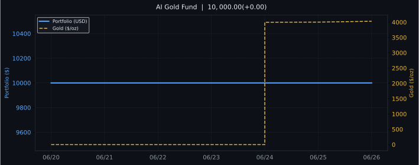

# 📈 AI Gold Fund — Polymarket Signal Analyst

> 由 Polymarket 预测市场信号驱动的黄金投资分析系统。
> 每天 08:00 (北京时间) 自动分析、模拟交易、推送飞书。


## 最新信号



**[📊 查看完整交互看板 →](https://kizimi.github.io/polymarket-gold-analyst/dashboard/)**

---

## 数据来源

| 数据 | 来源 | 说明 |
|---|---|---|
| 预测市场 | Polymarket | 降息/地缘/通胀事件概率（免认证 API） |
| 黄金价格 | metals.live | 现货价格 + 涨跌幅 |
| 宏观指标 | Yahoo Finance + FRED | DXY、美联储利率、10Y 美债 |

## 信号系统

| 综合评分 | 操作 |
|---|---|
| >= 7.0 | 买入（全仓） |
| 4.0 ~ 7.0 | 持仓不动 |
| <= 4.0 | 卖出（全仓） |

## 模拟基金

- 起始资金：$10,000 USD
- 开始日期：2026-06-18
- 策略：纯 AI 信号驱动，不加杠杆

## 本地运行

```bash
git clone https://github.com/kizimi/polymarket-gold-analyst
cd polymarket-gold-analyst
cp .env.example .env   # 填入 keys
pip install -r requirements.txt
python main.py         # 查看今日信号，支持追问
python run_daily.py    # 完整日报流水线
```

## GitHub Secrets 配置

Settings -> Secrets -> Actions 中添加：

| Secret | 获取方式 |
|---|---|
| `ANTHROPIC_API_KEY` | console.anthropic.com |
| `FRED_API_KEY` | fred.stlouisfed.org（免费注册） |
| `FEISHU_WEBHOOK_URL` | 飞书群 -> 机器人 -> 添加 Incoming Webhook |

---

*不构成投资建议。*
